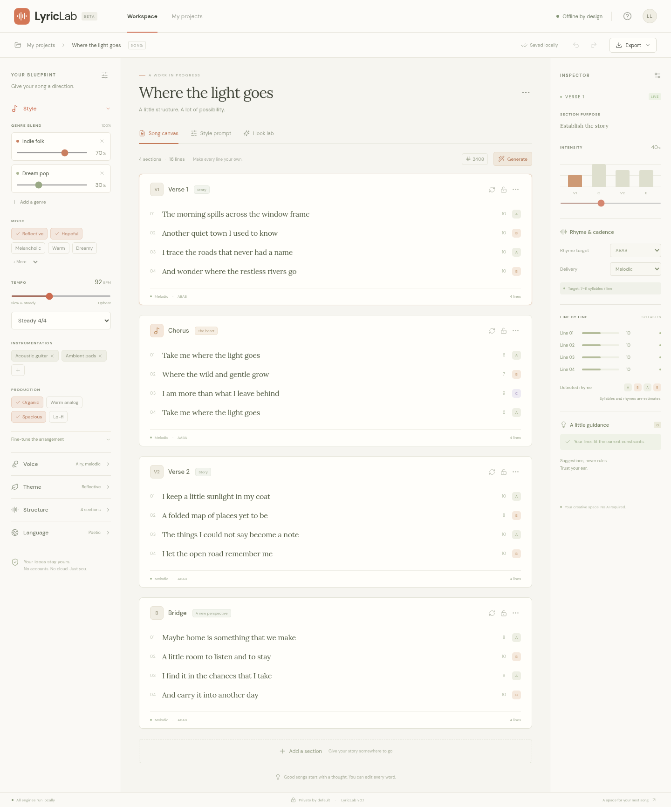

# LyricLab

A standalone, client-only songwriting studio built with React, Vite, and TypeScript. No accounts, API keys, LLM, SonicStudio runtime, or external runtime services.

## Canonical repository

[Blazerfool01/lyriclab](https://github.com/Blazerfool01/lyriclab) is the source of truth for code, tests, and documentation. The `main` branch holds the accepted baseline. Future changes should arrive through branches and pull requests with the checks below.

- [Product principles and milestone roadmap](docs/ROADMAP.md)
- [Development and contribution workflow](docs/DEVELOPMENT.md)
- [Current portable project / SongSpec format](docs/SONGSPEC.md)
- [Guidance for coding agents](AGENTS.md)



## Run

```sh
npm ci
npm run dev
```

The development server listens on port 5173. To use the production offline cache:

```sh
npm run build
npm run preview
```

The production app bundles its fonts, icons, data, and engines and pre-caches its assets in a service worker. Once opened and cached on localhost or HTTPS, it can reopen with the network disabled. An initial web installation requires access to the served assets; a local copy can be served without an internet connection. Development dependency installation requires a network connection unless packages are cached.

## Run the bundled build offline

The earlier downloadable project includes a compiled `dist/` folder. GitHub tracks the source; build `dist/` with `npm run build`, or download the `lyriclab-offline-build` artifact from a successful GitHub Actions run. Serve that folder with any local static server, without installing npm packages. For example, with Python installed:

```sh
python3 -m http.server 8000 --directory dist
```

Open `http://localhost:8000`. Internet access is not needed. Opening `index.html` directly with a `file://` URL is not supported by browser module and service-worker rules. Third-party font and library licenses are included in `licenses/`.

## Delivered scope

The v0.1 Style Foundation is implemented, with an initial functional authoring workspace for later milestones:

- Weighted blends across 10 genre / micro-genre definitions, with mood, rhythm, tempo, voice, instrumentation, bass, drums, production, and mix controls.
- Seeded, deterministic style resolution, normalized genre weights, compatibility guidance, and Compact / Detailed / Annotated compilers.
- A responsive three-panel workspace with a mobile blueprint and inspector.
- Editable lyric sections, section purposes and intensity, section / line locking, reordering, duplicating, deleting, and undo / redo.
- Initial procedural hook and verse drafts using local theme-specific phrase banks; regeneration preserves authored and locked lines. A regenerated section's seed is retained.
- Estimated end rhyme and syllable analysis, delivery targets, avoided-phrase checks, and dismissible guidance for generated or manual text.
- A small reversible dialect vocabulary preview for British / American English. This is an initial vocabulary pack, not a full accent engine.
- Versioned browser-local projects, autosave, project import validation, and lyrics / annotated lyrics / style / project / SongSpec exports.
- An editable example song for first use.

The entire v1.0 roadmap is **not** declared complete. The current language and verse engines use curated templates and a limited local vocabulary. Future milestones still need deeper narrative state, pronunciation dictionaries, semantic constraint validation, hook-strength heuristics, richer cadence and dialect packs, a comprehensive blueprint editor, and a formally frozen interoperability schema. Syllable and rhyme results are estimates, including dialect pronunciation differences. `schemaVersion: 1` is validated and future versions are safely rejected; migration infrastructure beyond v1 remains future work.

## Data and architecture

- `src/domain/types.ts` — versioned domain types.
- `src/domain/data.ts` — stable genre IDs, declarative sound / language data, and delivery ranges.
- `src/domain/engines.ts` — pure seeded style, lyric, rhyme, cadence, and dialect utilities, independent of React.
- `src/domain/project.ts` — validated serialization, local project loading, export, and example project.
- `src/App.tsx` — studio interactions.
- `src/styles.css` — responsive visual system.
- `vite.config.ts` — build-time production asset pre-cache.

The compiler is a derived value and is not stored. Project JSON retains editable lyrics (including authored and locked status), style, seed, language, section metadata, and settings. Saving uses `lyriclab.projects.v1` in LocalStorage; browser storage belongs to the device and browser profile. Export projects for durable backups. Corrupt storage is reported and not silently replaced.

## Verification

```sh
npm test
npm run build
npm run test:ui
```

UI tests use the production preview on port 4173 and Playwright Chromium. On first setup, run `npx playwright install --with-deps chromium`. To use an existing system browser instead, run `PLAYWRIGHT_CHROMIUM_EXECUTABLE=/usr/bin/chromium npm run test:ui`. Tests cover style updates, locked/manual edits, save and reopen, hook insertion, JSON export and re-import, and network-disabled reopening. Reference screenshots are in `docs/images/`. GitHub Actions runs the domain tests, production build, and browser suite on pushes to `main` and on pull requests. The initial verified baseline contains 40 domain tests and 7 browser tests.

Text fields have their native undo behavior. The toolbar undo / redo tracks project editing actions. `Ctrl/Cmd+S` exports a complete project backup; `Escape` dismisses dialogs.
