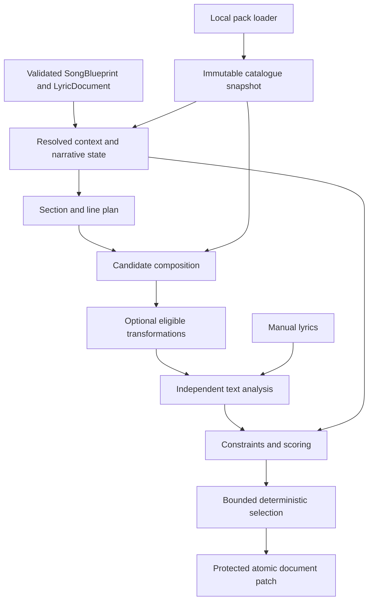

# Engine Foundation architecture

Status: A–H approved by the project owner. This document records the agreed architecture. Stages A–B provide contracts, fixed v0.1 characterization fixtures, immutable catalogs, and named streams. Stages C–H remain implementation work; their behavior is not active merely because a target interface exists.

Read this together with [ENGINE_VERSIONING.md](ENGINE_VERSIONING.md), [the product roadmap](ROADMAP.md), and [current SongSpec documentation](SONGSPEC.md).

## 1. Current architecture map

```text
App.tsx
  ├─ types.ts: Project, StyleSpec, SongSection, LanguageProfile
  ├─ data.ts: genre descriptors, palettes, delivery ranges, conflicts
  ├─ engines.ts
  │    ├─ resolveStyle → compileStyle
  │    ├─ generateLines: lookup, templates, perspective, bans, cadence, replacement
  │    ├─ syllables / rhymeKey → analyzeSection: measurements and warnings
  │    └─ dialectPreview: embedded vocabulary substitutions
  └─ project.ts: example factories, validation, LocalStorage, downloads, export
```

`Project` currently serves as editor state, generator input, persistence shape, and SongSpec export. Pure functions already work independently of React, but application orchestration and several engine responsibilities are coupled.

## 2. Preserve these strengths

Preserve offline operation, explicit seeds, immutable generation, default protection of authored/locked text, declarative initial data, analysis for manual lyrics, persisted editable lyrics, and the existing regression suite. Current packs and engine heuristics are useful compatibility fixtures. Keep public v0.1 entry points through adapters while ownership moves behind them. No UI redesign is required.

## 3. Expensive coupling to remove

- `generateLines` performs data lookup, phrase construction, perspective conversion, banned-phrase filtering, random selection, cadence shaping, and protected-line replacement. It has no separately scored candidate contract.
- Many selections are display labels. Genre descriptor positions and phrase-bank ordering affect semantics/randomness. String-substring deduplication substitutes for trait identity.
- Purpose, intensity, concept, secondary theme, preferred terms, register, target rhyme, and explicit syllable range do not currently direct lyric selection. Preserved neighboring lines are not used to plan continuity.
- Generation hard-codes cliché rules, while analysis reads only avoided phrases. Dense delivery adds first-person wording after perspective conversion. Delivery presets override explicit syllable ranges in analysis.
- Regeneration changes the global style seed and can depend on undo-history length. Accepted hooks lose their archetype/seed and change identity even though identity influences generation.
- Protection is repeated in generation and dialect UI; dialect application does not check the section lock.
- Validation depends on the installed genre catalogue, removes unknown IDs, allocates repair UUIDs, silently truncates content, and can mark unknown imported authorship as replaceable.
- Project and SongSpec exports are currently identical, exposing editor implementation fields to interchange consumers.

These are known legacy limitations. Stage A records them; it does not fix them or expand datasets.

## 4. Target architecture



Use small TypeScript modules composed through functions/interfaces, without a general runtime plugin framework. Infrastructure asynchronously loads local packs; pure engines receive a complete immutable catalogue snapshot. No engine fetches files, reads storage, allocates UUIDs, reads the clock, or reaches into React.

Suggested responsibility groups: model, catalogue, randomness, style resolution/compiler, structure planner, language resolver, narrative reducer, lyric planning/composition/evaluation/search, analyzers, constraints, dialect, editing/application, and serialization. Browser adapters own persistence, downloads, and loading. Do not create empty module trees before their stage needs them.

## 5. Target TypeScript contracts

[contracts.ts](../src/domain/foundation/contracts.ts) defines compile-time boundaries. [contracts.typecheck.ts](../src/domain/foundation/contracts.typecheck.ts) checks readonly inputs/output, synchronous composition, separation from scoring/randomness, shared application, and portable/export isolation through TypeScript compilation.

Four models have distinct jobs:

- `SongBlueprint`: creative intent, stable references, section role/constraints, root seed, and narrative goals.
- `LyricDocument`: accepted text, origin, locks/ranges, semantic annotations, and revision fingerprint.
- `ProjectEnvelope`: future local editing format, including blueprint/document and replay records.
- `SongSpec`: future projected interchange, with descriptive choices and ordered lyrics, excluding local protection/settings/recipes.

Other seams include versioned `ExecutionProfile`, synchronous `CatalogSnapshot`, `GenerationRequest`, `GenerationContext`, `SectionPlan`, unscored `LyricCandidate`, independent `TextAnalysis`, `CandidateEvaluation`, `GenerationResult`, `ReplayRecipe`, `TransformationPreview`, and common `DocumentApplicator`.

Readonly types document ownership; runtime validation and protection must still enforce invariants. Types do not validate seed ranges, pack availability, rule IDs, fingerprints, candidate mappings, score finiteness, or successful mutation safety. No schema migration or runtime adapter is introduced in Stage A.

## 6. Engine ownership

| Boundary | Owns | Must not own |
| --- | --- | --- |
| Catalogue | Pack validation, stable identities, indexed read-only views | Random draws, generation, editing |
| Style resolver | Weighted trait resolution, compatibility diagnostics | Prompt rendering |
| Style compiler | Formats a resolved style | Lookup or randomness |
| Structure planner | Roles, line slots, effective constraints | Lyric text |
| Language resolver | Semantic relevance, grammar/eligibility | Winner selection or state mutation |
| Narrative reducer | State from accepted, anchored annotations | Inventing facts from arbitrary manual text |
| Candidate composer | Realizes a section plan | Scoring or document changes |
| Analyzers | Measurements, evidence, uncertainty | Creative acceptance policy |
| Constraint evaluator | Hard-rule findings, interpretable preferences | Replacement wording |
| Search coordinator | Attempt budget, stable ranking, explicit failures | Content definitions |
| Dialect transformer | Preview edits, pronunciation hints, style metadata | Lyric composition or persistence |
| Document applicator | One lock/authorship/staleness policy for all patches | Generation or randomness |
| Serialization | Decoding, repair, migration, explicit SongSpec projection | Browser I/O |

Dependency flow is model → data resolution/planning → composition/transformation → analysis → evaluation/selection → application. Composition never calls the evaluator; the coordinator composes them. Analyzers take pronunciation views/hints instead of calling the dialect engine. Application cannot invoke generation. Compilers receive resolved output rather than resolving again.

## 7. Blueprint-to-candidate flow

1. Validate structural shape independently of installed packs.
2. Resolve exact profile dependencies; preserve missing references and diagnose them.
3. Normalize intent and effective constraints. Explicit section targets override delivery defaults in the target engine.
4. Determine editable slots and protected content, including locked ranges.
5. Derive narrative context from preceding accepted sections and authoritative annotations.
6. Plan semantic line functions, motifs, rhyme obligations, and cadence.
7. Compose independently seeded candidate attempts without mutating the document.
8. If requested, preview/apply eligible candidate dialect transformations.
9. Analyze final transformed text together with protected neighboring lines.
10. Evaluate hard rules separately from soft scores, then rank stably.
11. Return candidates/explanations or explicit exhaustion; never silently return unchanged lines as the target failure signal.
12. Apply the selected patch atomically after checking the current revision and protection.
13. Retain the accepted recipe and anchored annotations; recompute affected downstream narrative state.

Manual writing begins at editing/analysis, never generation. Newly generated banned phrases can be hard failures. An inherited violation in protected content is guidance and cannot force replacement or make every candidate inadmissible. Hard rules do not block creative manual editing. Both candidate and transformation patches use the common applicator; explicit authored replacement does not bypass locks.

## 8. Determinism

Use an exact execution profile, stable root seed, persistent generation keys, explicit variation counters, independently named streams per attempt, deterministic catalogue query order, fixed attempt budgets, and stable scoring/tie breaks. Do not use undo history, wall time, global random draws, or parallel completion order. A rejected attempt cannot shift another attempt's stream. Exact replay requires the original input, not a seed/hash alone. Detailed compatibility and storage rules are in ENGINE_VERSIONING.md.

## 9. Narrative state

Separate planned intent from established state. The initial state model tracks assertions with polarity/time frame, goals and their status, motifs, and line provenance. Sections have typed establish/develop/challenge/reveal/resolve roles; editable purpose remains explanatory prose.

Templates may declare semantic effects, but effects enter state only when accepted. Rejected candidates never change state. Confirmed user annotations and template-declared annotations are authoritative only while anchored to matching text. Manual text without annotations has unknown factual meaning. Lexical mentions may influence repetition/imagery scores without becoming asserted facts.

Manual edits invalidate stale generated annotations. Reordering or editing recomputes state from the affected boundary onward. Contradiction diagnostics distinguish temporal change, questioned beliefs, and incompatible simultaneous assertions; uncertain interpretation stays advisory. Narrative snapshots are disposable caches keyed by content/profile, not a second persistent source of truth. No event-sourcing system or natural-language inference engine is required.

## 10. Version implications

Separate Project schema, SongSpec schema, engine contracts, individual algorithms, and pack versions/hashes. v1 imports remain supported through future migration. Future unknown references survive loading; repairs are explicit and deterministic with reference remapping. Nonempty unknown-origin text is protected. Limits must be reported consistently instead of losing valid content.

Stage A does not activate `ProjectEnvelope` or `SongSpec`, change the current schemaVersion, or add profile metadata to saved data. Existing accepted text remains authoritative. Historical operation information that was never recorded cannot be reconstructed and must not be claimed as replayable.

## 11. Minimal migration

Characterize the current behavior first. Keep current entry points as facades. Extract the existing data unchanged into versioned indexed views. Separate style resolution/rendering, then measurement/evaluation. Centralize protection/application before routing both regeneration and dialect through it. Wrap the current generator as a legacy composer. Add isolated operation recipes, narrative scaffolding, and serialization adapters only at their scheduled stages. Route existing UI actions through these boundaries without redesigning the UI or adding content.

## 12. Approved implementation sequence

| Stage | Deliverable | Status |
| --- | --- | --- |
| A | Approved contracts, version policy, fixed characterization fixtures | Merged PR #1; gate below |
| B | Typed existing packs, indexed snapshots, named streams | Implemented; evidence in ENGINE_IMPLEMENTATION_LOG.md |
| C | Independent analyzers, shared diagnostics, hard/soft evaluation | Approved, pending |
| D | Common protection/application, atomic/stale patches | Approved, pending |
| E | Legacy composer adapter, bounded attempts, ranking/exhaustion | Approved, pending |
| F | Typed roles, annotation provenance, deterministic narrative state | Approved, pending |
| G | Replay records, v1 migration, separate SongSpec projection | Approved, pending |
| H | Workflow/offline regression and dependency-boundary verification | Approved, pending |

## Stage A Definition of Done

- [x] Architecture ownership and dependency flow recorded in repository documentation.
- [x] Approved version/replay/recovery policies recorded without activating new formats.
- [x] Target interfaces compile and are protected by compile-time boundary checks.
- [x] Fixed literal inputs/expected outputs cover style, lyrics, protection, analysis, dialect, and valid serialization/export.
- [x] Known legacy quirks are identified separately from target requirements.
- [x] Expected outputs are never regenerated by ordinary test execution.
- [x] Existing runtime engines, domain datasets, UI, dependencies, and persisted formats are unchanged.
- [x] Local production build, compile-time checks, 65 domain tests, and 7 browser tests pass.
- [x] GitHub PR build/domain/offline-browser checks pass ([Stage A verification run](https://github.com/Blazerfool01/LyricLab/actions/runs/37720435519)); every subsequent PR revision must also pass before acceptance.

## Full Engine Foundation Definition of Done (A–H)

- [ ] Immutable pure engine contracts are implemented independently of React/browser APIs.
- [ ] Existing packs have validated, versioned indexed catalogue snapshots; no dataset expansion.
- [ ] Composition, transformation, analysis, evaluation, selection, and application are independently testable.
- [ ] Attempts are bounded, ordering is stable, evaluation is explainable, and exhaustion is explicit.
- [ ] Every text-changing operation uses shared protection and atomic/stale application checks.
- [ ] Authored/locked text survives generation, dialect operations, imports, and stale results.
- [ ] Section regeneration does not change style randomness or unrelated recipes.
- [ ] Accepted hooks retain archetype, seed, scope, and exact profile.
- [ ] Replay fixtures cover dependency order, rejection, protected context, and serialization.
- [ ] Narrative state distinguishes intent, accepted evidence, and unknown manual meaning.
- [ ] Rejected candidates cannot affect state; narrative reduction is deterministic.
- [ ] Decoding, repair, migration, and SongSpec projection have distinct contracts/diagnostics.
- [ ] v1 migration preserves text, locks, and unresolved references.
- [ ] v0.1 behavior remains supported by compatibility adapters.
- [ ] Browser and network-disabled workflows pass after integration.
- [ ] Version guarantees and legacy replay limits are documented.

## Approval record

The owner approved stages A–H and Stage A as the first implementation. The approved decisions include future project-envelope migration; separate SongSpec projection with a legacy path; supported-profile replay with original inputs; separate operation streams and variation counters; hard/soft constraint policy with inherited guidance; annotation-driven narrative state; and conservative import/repair behavior. Stage A implements only contracts/policy/characterization. This approval is not a claim that B–H or v1.0 are complete.
